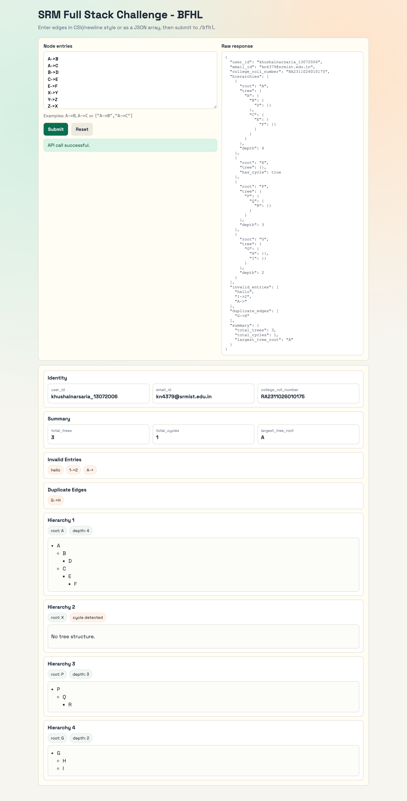

# BFHL Hierarchy API — SRM Full Stack Engineering Challenge

[](https://s-harshni.github.io/Bajaj-Code-Test/)


<!-- live-links -->
> 🔗 **Live demo:** [s-harshni.github.io/Bajaj-Code-Test](https://s-harshni.github.io/Bajaj-Code-Test/)  
> 👤 **Portfolio:** [s-harshni.github.io/S-Harshni](https://s-harshni.github.io/S-Harshni/)  
<!-- live-links -->

A REST API plus a single-page front end for the Bajaj Finserv Health (BFHL) coding challenge. `POST /bfhl` takes a list of parent→child edges such as `"A->B"`, validates them, builds every hierarchy (tree), detects cycles, and returns trees, depths and a summary.



## API

`POST /bfhl`

```json
{ "data": ["A->B", "A->C", "B->D", "X->Y", "Y->Z", "Z->X", "G->H", "G->H", "hello"] }
```

Response (abridged):

```json
{
  "user_id": "…", "email_id": "…", "college_roll_number": "…",
  "hierarchies": [
    { "root": "A", "tree": { "A": { "B": { "D": {} }, "C": {} } }, "depth": 3 },
    { "root": "X", "tree": {}, "has_cycle": true },
    { "root": "G", "tree": { "G": { "H": {} } }, "depth": 2 }
  ],
  "invalid_entries": ["hello"],
  "duplicate_edges": ["G->H"],
  "summary": { "total_trees": 2, "total_cycles": 1, "largest_tree_root": "A" }
}
```

`GET /health` returns `{ "status": "ok" }`. Any request whose `data` is not an array gets HTTP 400.

### Rules implemented

| Rule | Behaviour |
|---|---|
| Valid edge | Exactly `X->Y` with single uppercase letters; whitespace is trimmed |
| Invalid entries | Wrong format, lowercase/digits, self-loops (`A->A`), empty sides go to `invalid_entries` |
| Duplicates | A repeated edge is reported once in `duplicate_edges` |
| Multiple parents | The first parent seen for a child wins; later parent edges are ignored |
| Components | Edges are grouped into connected hierarchies, in order of first appearance |
| Cycles | A cyclic component returns `has_cycle: true` with an empty tree and no depth |
| Depth & summary | Depth = nodes on the longest root-to-leaf path; `largest_tree_root` breaks ties alphabetically |

## Run locally

```bash
npm install
npm start            # http://localhost:5000  (UI + POST /bfhl)
npm test             # node --test: 4 tests
```

```bash
curl -X POST http://localhost:5000/bfhl -H "Content-Type: application/json" \
     -d '{"data":["A->B","A->C","B->D","hello"]}'
```

Set `BFHL_USER_ID`, `BFHL_EMAIL_ID` and `BFHL_ROLL_NUMBER` to change the identity fields in the response.

## Deployment

- **Vercel:** `api/bfhl.js` is a serverless function; `vercel.json` rewrites `/bfhl` to it. The front end calls same-origin `/bfhl`.
- **Any Node host (Render, Railway…):** `npm start` runs the Express server, which serves the UI and the API.
- **GitHub Pages (static demo):** with no server, the page runs the same `lib/bfhlProcessor.js` in the browser, so the live demo works without a backend. Point it at a real API by setting `localStorage.BACKEND_URL`.

## Project structure

```
lib/bfhlProcessor.js    validation, tree building, cycle detection (shared by server, serverless and browser)
server.js               Express server: static UI + POST /bfhl + GET /health
api/bfhl.js             Vercel serverless handler
index.html, app.js      single-page UI: input, rendered hierarchies, raw JSON
tests/                  node:test suite
```

## Author

Challenge solution by **Khushal Narsaria** ([GitHub](https://github.com/Khushal-Narsaria)). Hosted in this repository by [S Harshni](https://github.com/S-Harshni).
